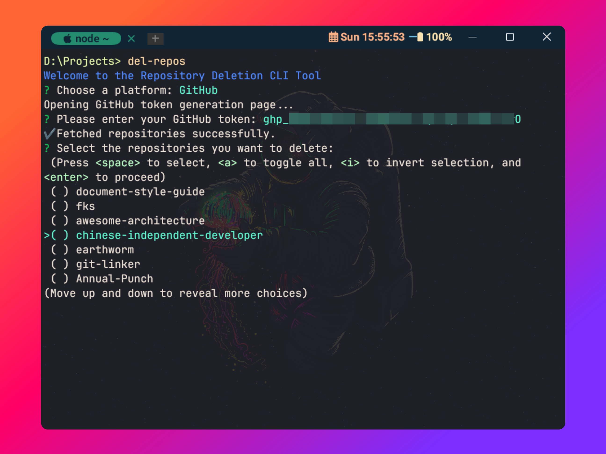

<h1 align="center">del-repos</h1>

<p align="center">
  <a href="./README.md">English</a> | <a href="./README.zh.md">中文</a>
</p>

<p align="center">
  
  
  
  
</p>

<p align="center"></p>

## ⚡ Introduction

`del-repos` is a powerful command-line tool for batch deleting GitHub or Gitee repositories with an intuitive interactive interface.

## 🛠️ Features

-   🌐 **Multi-platform Support**: Works with both `GitHub` and `Gitee` platforms
-   🔍 **Smart Search**: Advanced search functionality to quickly find repositories
-   ✅ **Batch Selection**: Select multiple repositories with an interactive checkbox interface
-   🔐 **Token Management**: Secure token storage and automatic token validation
-   🎯 **Repository Filtering**: Choose between personal repositories or all accessible repositories
-   💾 **Configuration Persistence**: Save tokens for future use
-   🎨 **Rich UI**: Beautiful colored output with progress indicators and spinners
-   ⚠️ **Safety First**: Multiple confirmation steps to prevent accidental deletions
-   📊 **Detailed Feedback**: Comprehensive error handling and operation summaries

## 🚀 Installation

### Prerequisites

-   `Node.js` v14.0.0 or higher installed on your computer
-   You can download and install Node.js from the [official website](https://nodejs.org/)

### Installation Steps

Install the package globally using npm or pnpm:

```bash
# Using npm
npm install del-repos -g

# Using pnpm
pnpm install del-repos -g

# Using yarn
yarn global add del-repos
```

## 📋 Command Line Options

| Option            | Description                                   |
| ----------------- | --------------------------------------------- |
| `-v`, `--version` | Display the current version                   |
| `-h`, `--help`    | Show help information                         |
| `-t <type>`       | Repository type filter (`o`: owner, `a`: all) |

### Repository Type Filter Examples

```bash
# Get only repositories you own
del-repos -t o

# Get all accessible repositories (default)
# (includes collaborator and organization repositories)
del-repos
# or
del-repos -t a
```

## 🌟 Usage

### Quick Start

Simply run the command to start the interactive deletion process:

```bash
del-repos
```

### Step-by-Step Process

1. **🚀 Platform Selection**

    - Choose between `GitHub` or `Gitee` platform
    - The tool provides a clean, interactive selection interface

2. **🔑 Token Authentication**

    - Enter your personal access token for the selected platform
    - The tool automatically opens the token generation page in your browser
    - **Required permissions:**
        - **GitHub**: `delete_repo`, `project`, `repo`
        - **Gitee**: Repository deletion permissions
    - Option to save token securely for future use

3. **📦 Repository Discovery**

    - The tool fetches your repository list with a progress spinner
    - Displays the total number of repositories found
    - Supports filtering by repository type (owner vs. all accessible)

4. **🔍 Smart Repository Selection**

    - **Search functionality**: Type to filter repositories in real-time
    - **Batch selection**: Use spacebar to select/deselect repositories
    - **Numbered list**: Easy navigation with numbered repository list
    - **Visual feedback**: Clear indication of selected repositories

5. **⚠️ Safety Confirmation**

    - **Danger zone warning**: Clear indication of the destructive nature
    - **Repository review**: List of all repositories to be deleted
    - **Final confirmation**: Explicit confirmation required before deletion

6. **🗑️ Deletion Process**
    - Real-time progress updates with spinners
    - Detailed error handling and reporting
    - Success summary upon completion

## ⚠️ Important Considerations

### 🚨 Safety Warnings

-   **⚠️ IRREVERSIBLE ACTION**: Deleted repositories **CANNOT** be restored
-   **🔍 Double-check**: Always verify the repositories you're about to delete
-   **🔐 Token Security**: Keep your access tokens secure and never share them
-   **📝 Backup**: Consider backing up important repositories before deletion

### 🔑 Token Requirements

#### GitHub Token Permissions

-   `delete_repo` - Required for repository deletion
-   `project` - Access to project boards
-   `repo` - Full repository access

#### Gitee Token Permissions

-   Repository deletion permissions must be enabled

### 🛠️ Troubleshooting

If you encounter issues, please check:

-   ✅ Your internet connection is stable
-   ✅ Your token has the required permissions
-   ✅ The platform API is accessible
-   ✅ You have the necessary repository access rights

For additional help or to report bugs, please [submit an issue](https://github.com/yaolifeng0629/del-repos/issues).

## 🙌 Contributing

We welcome all contributions and suggestions! If you want to contribute to `del-repos`, here's how:

### Development Setup

1. **Clone the repository:**

    ```bash
    git clone https://github.com/yaolifeng0629/del-repos.git
    cd del-repos
    ```

2. **Install dependencies:**

    ```bash
    npm install
    # or
    pnpm install
    ```

3. **Development and testing:**

    ```bash
    npm run dev
    # or
    pnpm dev
    ```

4. **Build the project:**
    ```bash
    npm run build
    ```

### How to Contribute

-   🐛 **Report bugs** by [creating an issue](https://github.com/yaolifeng0629/del-repos/issues)
-   💡 **Suggest features** through issue discussions
-   🔧 **Submit pull requests** for bug fixes or new features
-   📖 **Improve documentation** to help other users
-   ⭐ **Star the repository** if you find it useful

### Development Guidelines

-   Follow the existing code style and conventions
-   Add tests for new features
-   Update documentation when necessary
-   Ensure all tests pass before submitting PR

**Thanks to all contributors who have helped make `del-repos` better!** 🎉

## ⭐ Support the Project

If you find this tool helpful, please consider:

-   **⭐ Star the repository** on [GitHub](https://github.com/yaolifeng0629/del-repos)
-   **📣 Share with others** who might benefit from it
-   **🐛 Report issues** to help improve the tool
-   **🔧 Contribute** to make it even better

Your support is the driving force for continued development!

## 📊 Star History

[](https://starchart.cc/yaolifeng0629/del-repos)

## 📄 License

This project is licensed under the ISC License - see the [LICENSE](LICENSE) file for details.
