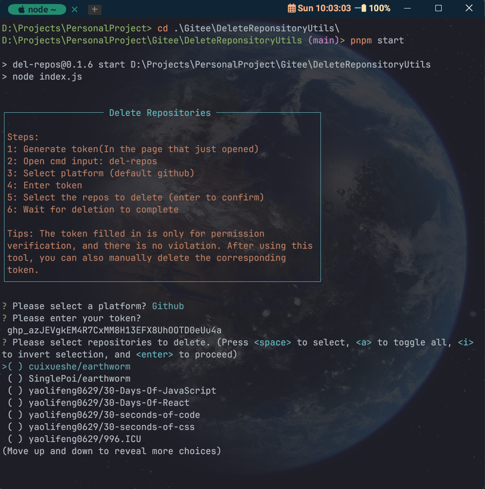

# del-repos

<span>English | <a href="./README.zh.md">中文</a></span>



## ⚡ 介绍

del-repos 是一个命令行工具，它可以帮助你批量删除 GitHub 上的仓库。这个工具非常适合需要管理大量仓库的开发者。

## 🚀 安装

### 前提条件

-   你需要在你的机器上安装 Node.js 和 npm。你可以从 [Node.js 官网](https://nodejs.org/) 下载和安装。

### 安装步骤

1. 打开终端
2. 输入以下命令来安装 del-repos：

```bash
npm install del-repos
```

## ⚠️ 使用

1. 在命令行中，运行以下命令来启动 del-repos：

```bash
del-repos
```

2. 然后会在浏览器中打开一个 Create Token 页面，此 Token 仅用于删除仓库。

3. 你会看到一个提示，让你选择一个平台（目前只支持 Github）。选择 Github 后，你需要输入你的 Github token。

4. del-repos 会获取你的所有仓库，并显示一个列表让你选择要删除的仓库。

5. 选择完毕后，del-repos 会开始删除你选择的仓库。

## ⚠️ 注意事项

-   请谨慎使用 del-repos，因为删除的仓库无法恢复。
-   在使用 del-repos 之前，确保你的 Github token 有足够的权限来删除仓库。
-   如果你遇到任何问题，或者有任何建议，欢迎提交 issue。

## 🙌 贡献

-   我们欢迎所有的贡献和建议。如果你想为 del-repos 做出贡献，你可以：

    -   提交 bug 报告或建议
    -   提交代码改进或新功能
    -   改进文档

-   感谢所有已经为 del-repos 做出贡献的人！🎉
